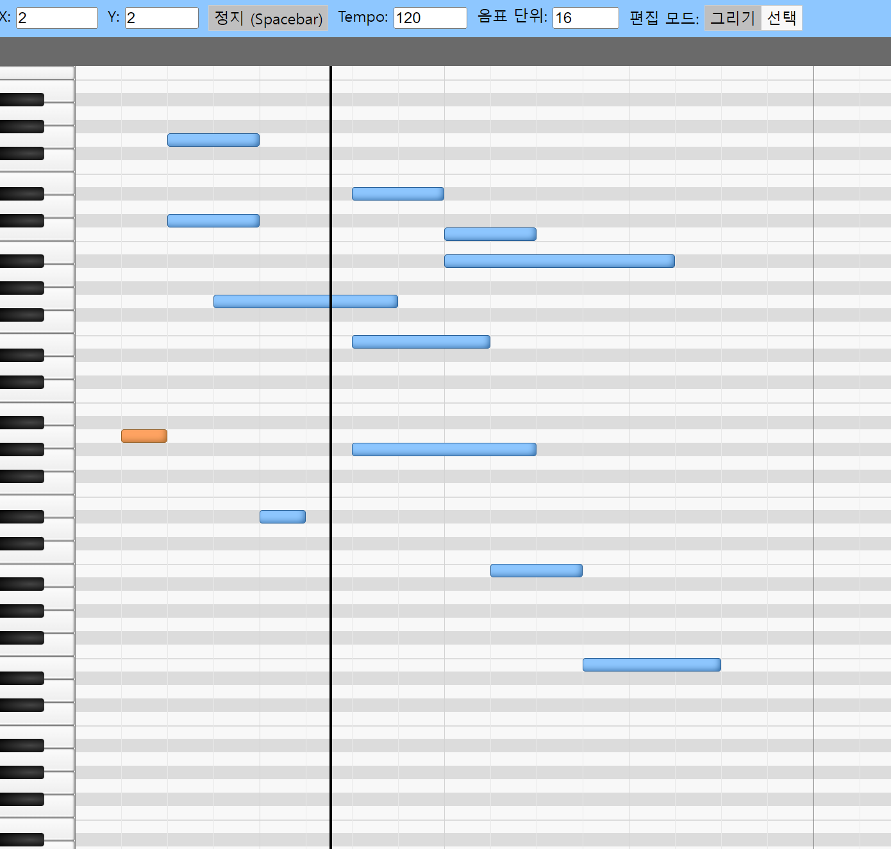

# 피아노 시퀀서 토이 프로젝트

Web Audio API를 활용하여 만든 간단한 시퀀서입니다.

## 조작법

조작 인터랙션은 Studio One의 Piano Roll 조작법을 참고하였습니다.\
X: X축(시간)을 축소/확대 할 수 있습니다.\
Y: Y축(음정)을 축소/확대 할 수 있습니다.\
Tempo: Playback의 BPM을 조절할 수 있습니다.\
음표 단위: 입력할 음표의 그리드를 조절할 수 있습니다.\
편집 모드: 그리기/선택 모드를 선택할 수 있습니다.

건반을 클릭하여 소리를 들을 수 있습니다

'그리기' 모드에서는 마우스를 드래그하여 노트를 추가할 수 있고,\
다시 클릭하면 노트가 지워집니다.\
노트 추가시, 해당 노트가 연주됩니다.\
'그리기' 모드의 단축키는 숫자 '1'입니다.

'선택' 모드에서는 노트를 선택하여 지울 수 있고,\
드래그하여 시간 및 음정을 변경할 수 있습니다.\
'선택' 모드의 단축키는 숫자 '2'입니다.\
Delete 혹은 Backspace 키를 누르면 선택한 노트가 지워집니다.

재생 버튼 혹은 Spacebar를 누르면 현재 Piano Roll을 재생합니다.
